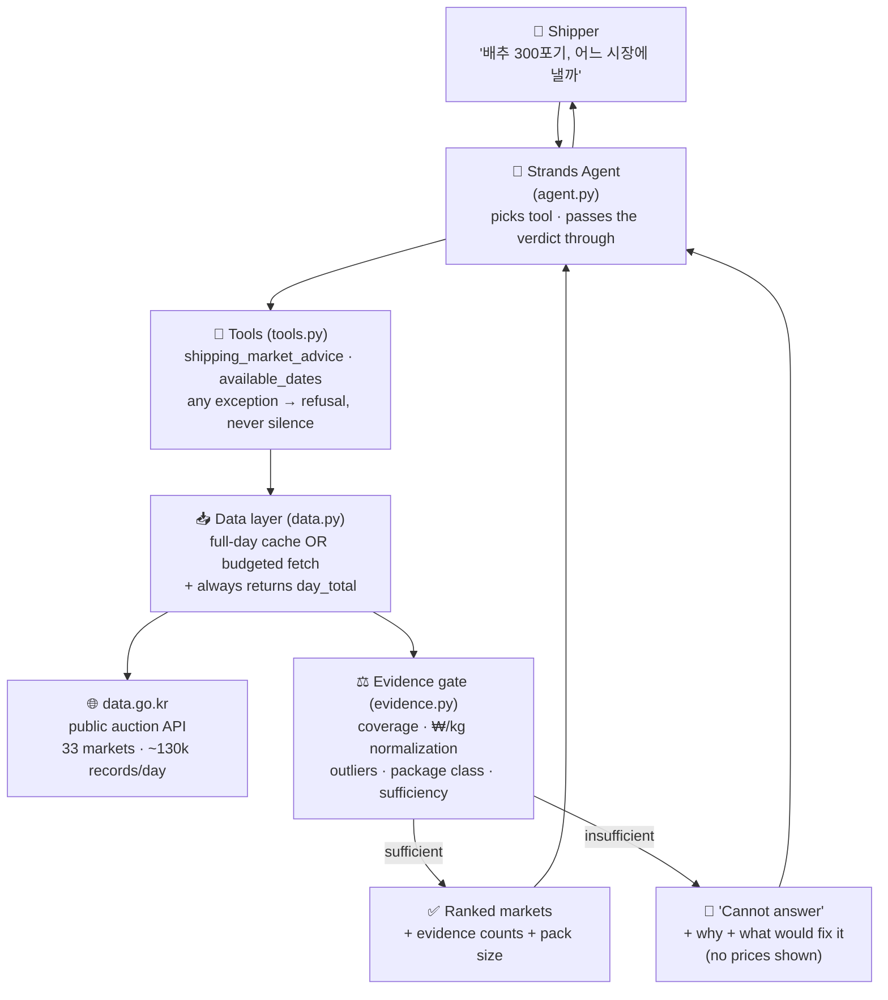
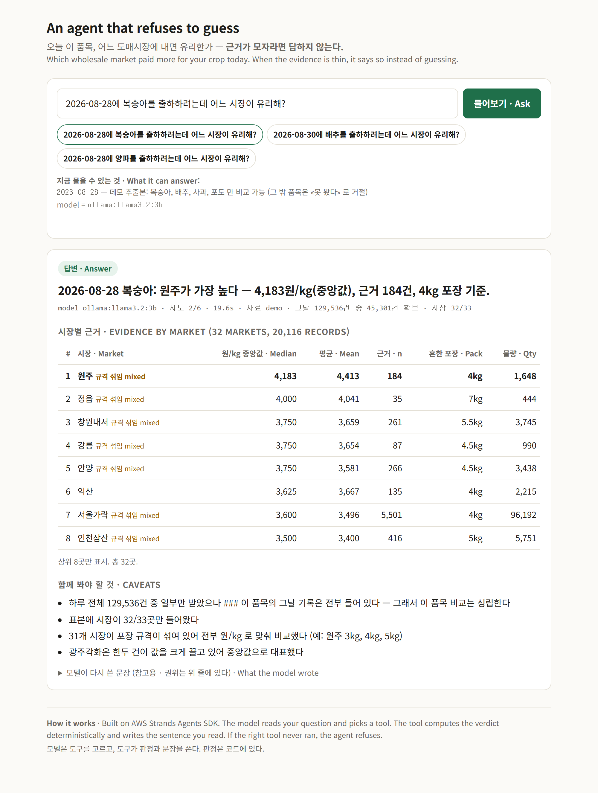
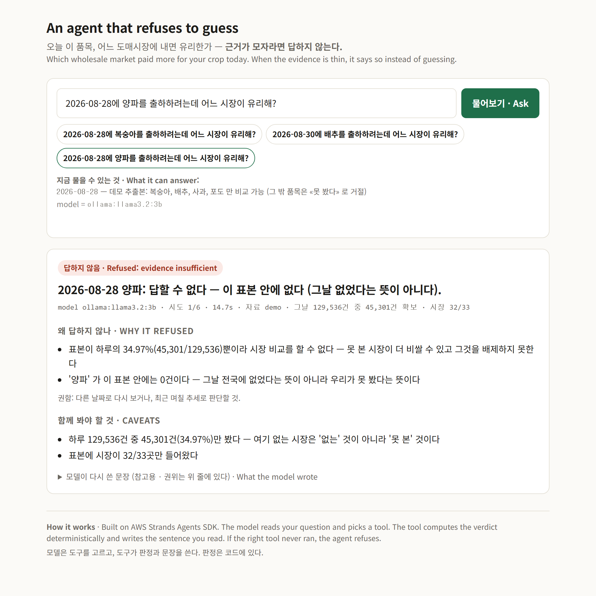

# An agent that refuses to guess

**Agents for Humans** hackathon · Professional track · Built with **AWS Strands Agents SDK**

Some decisions come back every single day, and the data that should settle them is scattered enough
that people end up going on instinct. **This agent takes one of those decisions and does the
checking — and when the evidence is not good enough, it does not answer.**

The first case we built it for: a Korean produce farmer asking *"where has my crop been fetching
more?"* — so the interface, the data and the sample output below are in Korean. That is the point,
not an oversight: the tool reads a Korean government feed and answers in the user's language.

---

## The problem

A decision that returns every morning, with data nobody has time to check properly. Our first case
is a produce farmer choosing among 33 public wholesale markets. Picking wrong costs real money:
across the 16 date × product pairs we measured, the gap between the best and worst market on the
same day ran **45% to 5,500%** (median 207%) — but the widest gaps are not opportunities: they
compare retail bags to bulk boxes. The agent flags that rather than recommending it.

Public auction data exists. Tools that read it exist. We audited **one** of them — our own,
published before this hackathon — and found it answering confidently on **0.77% of the day**.
We make no claim about anyone else's; we only know what ours cost us.

*Source: data.go.kr public auction feed (Korea Agro-Fisheries & Food Trade Corp.), settlement date
**2026-08-28**. The market count is that feed's own list, not an independent census.*

> **Why you will see both 33 and 32.** 33 is the roster — every market the feed lists, whether or
> not it traded that day. 32 is how many actually appear in that day's records. The one missing is
> **부산국제수산**, a seafood market, which is what you would expect in a produce query. Neither
> number is wrong; they count different things, and we say which one we mean each time.

| | |
|---|---|
| Records in one day | **129,536** |
| What the existing tool fetches before filtering | **1,000 (0.77%)** |
| Markets present in that slice | **6 of 33** — one market is **64.3%** of it |
| **Markets it structurally never sees** | **at least 26** — of the 32 markets present in that day's records, only the 6 above are in the slice. Among the missing: **Seoul Garak**, alone **25.6%** of the day (33,124 of 129,536), 2.6x the next market |

*Counts as measured **2026-08-30**. The feed is revised retroactively: re-running the same script on
09-01 returned **129,704** records for the same settlement date (Garak **33,207**). The ratios above
are unchanged. We report the number we measured and the day we measured it, because a reviewer who
re-runs it will not get our figure back.*

### It still answers. That is the problem this project is about.

---

## What this agent does differently

1. ### **It measures its own evidence before answering.**
   Coverage (what fraction of the day did we actually see?), market count, record count per market.
2. ### **When the evidence is thin, it says so — and says exactly why.**
   Not *"insufficient data"*. It names the ratio, the markets that fell short, and what would fix it.
3. **It normalizes units.** Auction prices come per package (4 kg, 5 kg, 10 kg boxes).
   Averaging raw prices compares a small box to a big one — **that flips "which market pays most" in 9 of 16 cases we measured.**
4. **It is robust to outliers.** One record at ₩500,005/kg among 656 moved a market's average by **21%**.
   We report the median and flag when mean and median diverge.
5. ### **The verdict is computed in code, not asked of the model.**
   A prompt asking a model to *"be careful"* is a hope. A tool that returns `insufficient` is a
   constraint — though a constraint is not a guarantee, and the measurements below say how much
   still gets past it.

---

## Architecture



**Note on what is *not* in this diagram.** We have a pre-existing MCP server for the same data
([`korean-agriculture-mcp`](https://github.com/SongT-50/korean-agriculture-mcp)). The agent does
**not** call it, and that is deliberate: its market comparison is the 0.77% behaviour described
above. Wiring it in would give the model a way around our evidence gate. It appears here only as
**the tool we audited** — and separately, `../probe_02_mcp_bridge.py` shows Strands consuming it
unchanged, which is how we learned the SDK.

**AWS**: Strands Agents SDK drives the loop. The model provider is selected by one environment
variable: `SHIPPER_PROVIDER=ollama` (default, local, zero cost, what every number in this README
was measured on) or `SHIPPER_PROVIDER=bedrock` (`strands.models.BedrockModel`, default model
`us.amazon.nova-lite-v1:0`, needs AWS credentials and is billed per call). **We have not yet run
the Bedrock path ourselves**; if that changes before the deadline, the measurement will be in
`measurements/` with the model id, and if it does not, this sentence stays as it is.
⚠️ **Strands defaults to Bedrock if you do not name a model.** We always name one explicitly.

---

## Three runs, three different answers

Real output, unedited. It is in Korean because the user is — English glosses added here for reading.

```
질문: 2026-08-28에 복숭아를 출하하려는데 어느 시장이 유리해?
→ 원주 시장이 유리합니다. 4,183원/kg …            [근거 184건 · 32개 시장 비교]

   "Peaches, Aug 28 — which market is better?"
   → Wonju. 4,183 won/kg …          [184 records across 32 markets]

질문: 2026-08-30에 배추를 출하하려는데 어느 시장이 유리해?
→ 답할 수 없다 — 그날 '배추' 경매 기록이 전국에서 0건이다.   [추천하지 않음]

   "Cabbage, Aug 30 — which market is better?"
   → Cannot answer. There were zero cabbage auction records nationwide that day.
                                     [no recommendation]

질문: 2026-08-28에 양파를 출하하려는데 어느 시장이 유리해?
→ 답할 수 없다 — 이 표본 안에 없다 (그날 없었다는 뜻이 아니다).   ["없다"가 아니라 "못 봤다"]

   "Onions, Aug 28 — which market is better?"
   → Cannot answer. Not in this sample — which is not the same as not existing.
                                     [not "absent", but "unobserved"]
```

### The second and third are the product.

And it is not a prompt asking the model to be careful. Five constraints make it hold:

- **The refusal screen carries no prices.** We first showed them labelled *"reference only, do not
  cite"* — and the model cited them anyway, in **4 of 6 runs**. Labels are requests. Removing the
  numbers is a constraint. After the change: **1 of 6.**
- **A tool failure becomes a refusal, never silence.** When the tool crashed on a day with no data,
  the model filled the gap with markets that do not exist. Any exception now returns *"cannot
  answer"* instead.
- **The answer line is written by code, not by the model.** The model chooses the tool; the tool
  writes the sentence. We tried letting the model phrase it and measured the result: `giá`, `trung`,
  `bình` and stray Han characters appeared in **4 of 6 runs**, and one run relabelled a quantity
  (1,648) as a record count. The agent now prints the tool's line and refuses if the right tool
  never ran. Across the three demo scenes, **12 of 12 runs** produced the intended answer with no
  script contamination.
- **The line the model copies carries no statistics.** Our refusal headline once read *"only 34.97%
  (45,301/129,536) of the day"* — and the model spun those digits into a table of per-date record
  counts it had never queried. The reasons still appear in full below; the copied line is now plain
  words. After the change, **0 of 6 runs invented a number.**
- **The model cannot quietly change what it was asked about.** Guarding the model's *output* left its
  *input* open: it once passed a garbled product name into the tool, and the refusal that came back
  was correctly formatted around a word the user never typed. The agent now compares the product the
  model passed against the question the user wrote, and refuses if they differ. The scope of the
  guard had been narrower than the scope of the failure.
- **The same guard, for dates.** An adversarial review of the web path found the product check had a
  twin hole: the model could query a different day than the question named. It now refuses when the
  date the tool looked at is not the date the question gave, and when the question names more than
  one date it refuses rather than picking the first. Dates are read in `2026-08-28`, `2026.8.28`,
  `2026/8/28` and `2026년 8월 28일` form. **A date written any other way reads as "no date given,"
  and then this guard does not apply** — the other checks still do.

`test_tools.py`, `test_agent_guard.py` and `test_run_contract.py` hold these in place. The last one
was written from an adversarial review of the web path and fails 11 of its checks on the code as it
stood before that review, which is the only reason to trust that it checks anything.

---

## Run it

```bash
python -m venv .venv

# macOS / Linux
.venv/bin/pip install "strands-agents" "strands-agents-tools" "strands-agents[ollama]" httpx
PY=.venv/bin/python

# Windows
.venv/Scripts/pip.exe install "strands-agents" "strands-agents-tools" "strands-agents[ollama]" httpx
PY=.venv/Scripts/python.exe

ollama pull llama3.2:3b            # or set SHIPPER_MODEL / use Bedrock

$PY agent.py                       # three demo scenes (92-209 s measured, n=2), no API key needed
$PY agent.py "배추 어디에 낼까"       # single question
$PY test_evidence.py               # 26 controls (evidence gate)
$PY test_tools.py                  # 33 controls (tool layer, incl. refusal path)
$PY test_agent_guard.py            # 16 controls (agent loop: leaked tool calls, product swaps)
```

### Web UI (same agent, same tool, same verdict)

```bash
$PY web.py                         # http://127.0.0.1:8620  (uvicorn + starlette, both already pulled in by strands)
```

The page calls `agent.run()`, the exact function the CLI uses; there is no separate "UI path". The
table is built from the `Evidence` object the tool computed on that call, so the numbers on screen
and the sentence the model was given come from one computation. When the tool refuses, the page
shows the reasons and the markets it saw, and **withholds the prices** for the same reason the
text output does: a ranking from a truncated sample should not be quotable. The first line under
the input says which dates and products the bundled sample can actually answer, so a demo cannot
be mistaken for coverage it does not have.

| answered | refused |
|---|---|
|  |  |

Both screenshots are real model runs on the bundled data (`_diag_web_ui.py` in `measurements/`
reproduces the three demo scenes end-to-end through the HTTP API; 3 of 3 matched the expected
verdict on the run we recorded, which is one run, not a reliability figure).

`DATA_GO_KR_API_KEY` (free, from data.go.kr) is only needed for dates outside the bundled sample.
Without it the agent says it could not look, which is not the same as saying there was nothing.

That distinction changes what the three scenes show, so it is worth stating plainly:

| | with a key | without a key |
|---|---|---|
| peaches, 08-28 | answers | answers (bundled) |
| napa cabbage, 08-30 | *"nothing was auctioned nationwide that day"* | *"we could not look"* |
| onion, 08-28 | *"not in this sample — which is not the same as not existing"* | same |

Both columns are honest. The middle row is the only place they differ, and the difference is the
point: **one row is an absence we verified, the other is an absence we could not check.**

**Optional env**: `SHIPPER_MODEL` · `OLLAMA_HOST` · `SHIPPER_CACHE` · `SHIPPER_ENV_FILE`

### About the bundled data

A full day is ~130k records and ~90 MB, which does not belong in a repo. So the repo ships
`_cache/demo-2026-08-28.json.gz` (0.27 MB): **complete records for four products** on one day.

`agent.py` pins itself to that bundled file even if you have full days cached locally — otherwise a
developer's machine and a reviewer's machine show different answers to the same question. We found
that the hard way: a teammate ran the demo and scene 3 answered instead of refusing, because their
copy had the full day. Both behaviours were correct; the report was not.

The file states its own limits — the *true* day total (129,536) and which products it is complete
for. The evidence gate reads both. Ask about a listed product and you get a real comparison; ask
about anything else and you get a refusal that says *"we did not see it,"* not *"it does not exist."*

That distinction is the whole product, so we were not willing to ship a sample that lied about
being a full day.

To work with a real full day: `cd measurements && python measure_unit_effect.py` (fetches and
caches, ~4 min/day), then `python build_demo_cache.py <date>` to make a new compact extract.

---

## 🆕 New for this hackathon / ♻️ Pre-existing

The hackathon requires new work and asks that pre-existing code be disclosed. Splitting it here
rather than later, because later it cannot be split honestly.

**New (built during the hackathon window)** — every file that ships: `evidence.py` · `data.py` ·
`tools.py` · `agent.py` · `config.py` · `build_demo_cache.py` · `test_evidence.py` · `test_tools.py` ·
`test_agent_guard.py` · everything in `measurements/`.

**Pre-existing (disclosed)** — [`korean-agriculture-mcp`](https://github.com/SongT-50/korean-agriculture-mcp),
an MIT-licensed MCP server for the same data, published by the same author before this hackathon.
**No code from it is reused here.** It is disclosed because it is the tool whose behaviour we
measured, and because our probe scripts connect to it while learning the Strands SDK.

We first wrote that the agent "calls it as a tool." It does not — `data.py` reads the public API
directly. We corrected the claim rather than the code, because routing through that server would
hand the model an ungated path to the same numbers our evidence gate exists to withhold.

**Deliberately excluded** — any private settlement/business data. The agent runs entirely on
**public** government data. (The hackathon FAQ asks the same: *"doesn't expose anything confidential"*.)

---

## What we measured, and what we did not

| Claim | Evidence | Reproduce |
|---|---|---|
| Existing tool sees 0.77% of a day | `totalCount` = 129,536 vs 1,000 fetched | `measurements/_check_truncation.py` |
| That slice is market-biased | 6 markets of the day's 32 · 64.3% one market · Garak absent | `measurements/_check_page1_bias.py` |
| Unit normalization flips the top market | **9 of 16** (date × product pairs) | `measurements/measure_decompose.py` |
| Outlier handling flips it too | **6 of 16**; combined **10 of 16** | `measurements/measure_decompose.py` |

Every claim above has a script. `measurements/README.md` maps each one to the question it answers,
with the sample size attached.

### ⚠️ Limits we are not hiding
- **n = 16 pairs.** We say *"often flips"*, not a percentage. The interval is wide.
- Products (8) were chosen by us; the full-day cache covers **2 days** (2026-08-27, 08-28).
- The market-bias measurement is **one day** (2026-08-28). We did not check whether the ordering is stable.
- Sufficiency thresholds (≥2 markets, ≥3 records each) are **chosen, not derived**.

---

## License

MIT — see [LICENSE](LICENSE).
